# DealMetrics — Inteligência de Preços

> Ferramenta web para precificação estratégica, análise de concorrentes, simulação de promoções e cálculo de metas de faturamento. Funciona em qualquer segmento do varejo.

HTML - CSS - JavaScript - Netlify

🔗 **[Acessar agora → deal-metrics.netlify.app](https://deal-metrics.netlify.app)**

---

## Contexto

Gestores do varejo perdem tempo precificando produtos manualmente em planilhas, sem visibilidade da concorrência e sem um cálculo estruturado de meta de faturamento. O DealMetrics resolve isso numa interface rápida, que roda direto no navegador — sem cadastro, sem servidor, sem instalação.

Nasceu no contexto do varejo farmacêutico e foi expandido para atender qualquer segmento comercial.

---

## Screenshots

**Calculadora — entrada de dados e resultado:**

| Dados para promoções | Comparativo | Promoções |
|---|---|---|
| 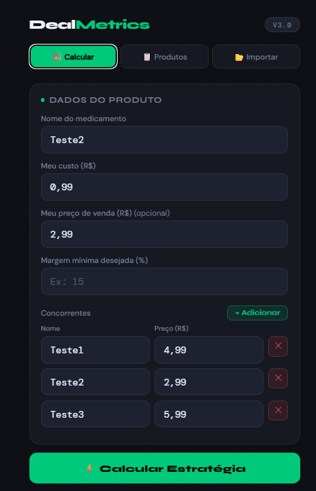 | 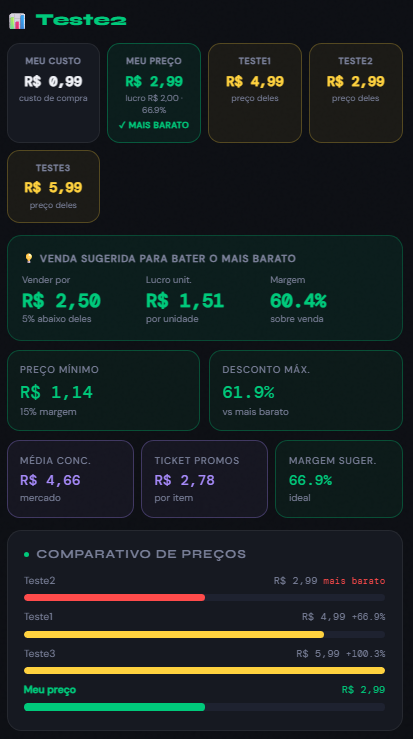 | 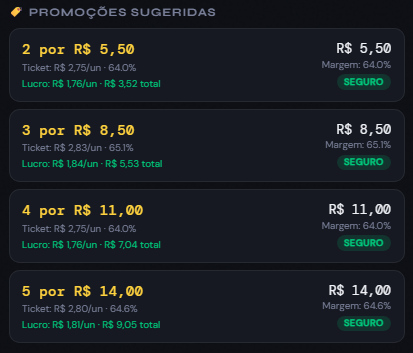 |

**Testar minha promoção:**

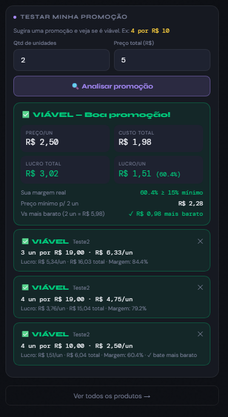

**Lista de produtos cadastrados:**

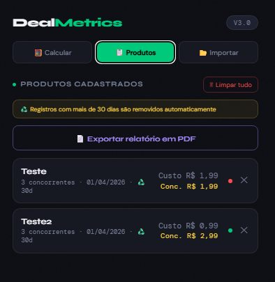

**Importação:**

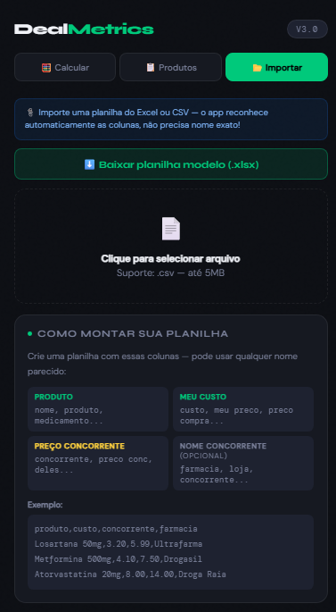

**Módulo de Meta — Filiais, Custos Fixos, Custos Variáveis:**

| Filiais | Custos Fixos | Custos Variáveis |
|---|---|---|
| 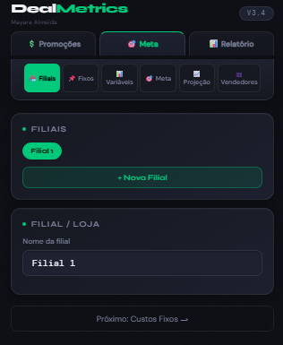 | 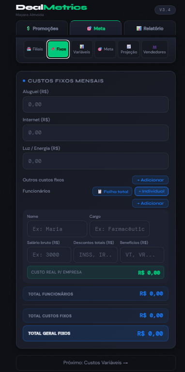 | 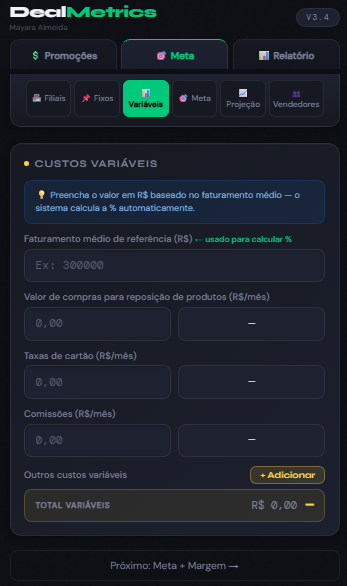 |

**Meta calculada e Projeção de Vendas:**

| Meta | Meta Calculada | Projeção |
|---|---|---|
| 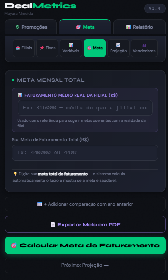 | 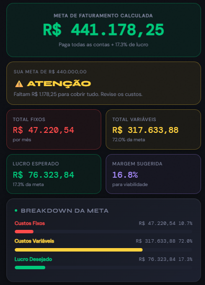 | 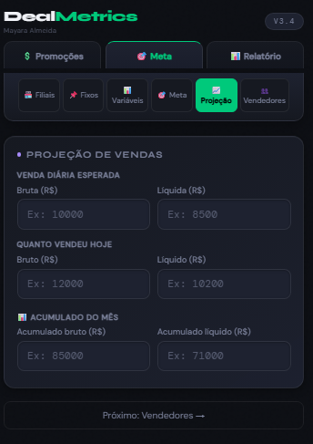 |

**Projeção por Vendedor:**


**Relatório completo:**

| Gerar Relatório | Página 1 | Página 2 |
|---|---|---|
| 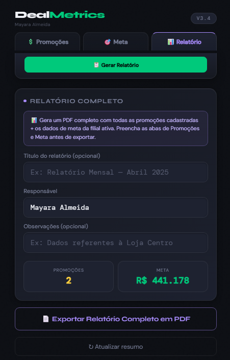 | 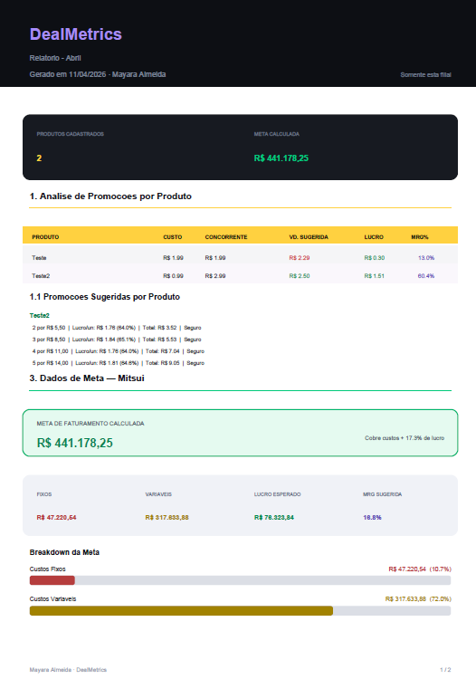 | 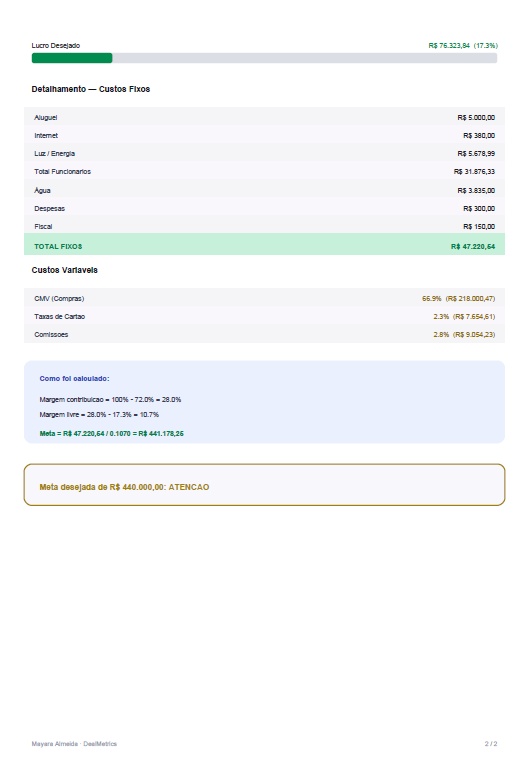 |

**PDF de promoções:**

| Tabela de produtos | Minhas promoções |
|---|---|
| 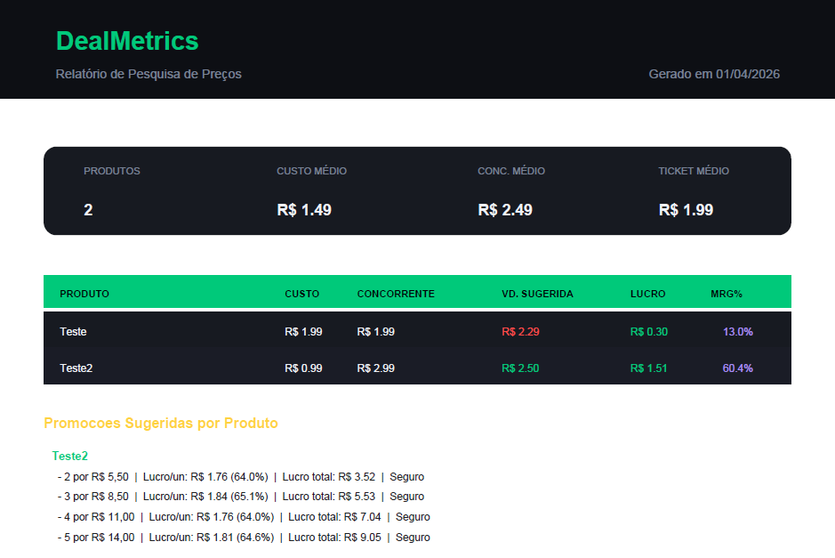 |  |

---

## Como Usar

**1. Calcular um produto**

- Informe o nome, custo de aquisição, preço de venda (opcional) e margem mínima desejada (padrão: 15%)
- Adicione ao menos um concorrente com nome e preço
- Clique em **Calcular Estratégia**

**2. Calcular a meta de faturamento**

- Acesse a aba **Meta**
- Cadastre sua(s) filial(is) e preencha os custos fixos (aluguel, folha, luz, outros) e variáveis (CMV, taxas de cartão, comissões)
- O app calcula automaticamente o faturamento mínimo necessário para cobrir todos os custos e projeta os resultados por período
- É possível distribuir a meta entre vendedores e ver a visão consolidada de todas as filiais

**3. Importar em lote**

- Acesse a aba **Importar**
- Baixe a planilha modelo ou monte seu próprio CSV
- Selecione o arquivo — o app processa e cadastra todos os produtos automaticamente

**4. Exportar relatório**

- Acesse a aba **Relatório**
- Clique em **Exportar relatório em PDF**
- O relatório inclui resumo geral, tabela de produtos, promoções sugeridas e o detalhamento da meta de faturamento

---

## Visão Geral

O DealMetrics é uma aplicação single-page (HTML/CSS/JS puro, sem backend) desenvolvida para apoiar gestores e analistas comerciais do varejo na precificação estratégica de produtos. A partir do custo de aquisição e dos preços praticados pela concorrência, o app calcula o preço de venda ideal, simula promoções por quantidade, avalia a viabilidade de cada cenário e calcula a meta de faturamento real com base na estrutura de custos da operação.

Toda a aplicação roda inteiramente no navegador — sem servidor, sem banco de dados remoto, sem login. Os dados ficam no `localStorage` do dispositivo e são limpos automaticamente após 30 dias.

---

## Funcionalidades

### Calculadora de Precificação

O núcleo do app. A partir do custo de compra e dos preços da concorrência, o sistema executa a seguinte lógica:

- **Preço mínimo viável** — calculado como `custo × (1 + margem_mínima / 100)`, garantindo que nenhuma venda ocorra abaixo do piso de rentabilidade definido
- **Preço sugerido** — posicionado 5% abaixo do concorrente mais barato, sempre respeitando o preço mínimo viável
- **Análise do preço informado** — se o usuário já tem um preço em mente, o app avalia se ele é viável (✅), merece atenção (⚠️) ou está inviável (❌) com base na margem mínima configurada
- **Comparativo visual** — cards lado a lado com meu custo, meu preço e cada concorrente, com destaque para o mais barato do mercado
- **Múltiplos concorrentes** — o sistema calcula menor preço, maior preço e média automaticamente

### Simulador de Promoções

Após o cálculo principal, o app gera automaticamente sugestões de promoções por quantidade (2, 3, 4 unidades), cada uma com preço total e por unidade, margem real, comparação com o concorrente e status de viabilidade. As promoções geradas podem ser salvas num histórico para comparação.

### Meta de Faturamento

Módulo para calcular o faturamento mínimo necessário para cobrir todos os custos da operação:

- Cadastro de custos fixos: aluguel, internet, energia, folha de pagamento (total ou individual por funcionário) e outros custos configuráveis
- Cadastro de custos variáveis: CMV, taxas de cartão e comissões — informados em R$ com base no faturamento médio de referência, e convertidos automaticamente em percentual
- Cálculo automático da meta com base na margem de contribuição real
- Comparação com ano anterior e avaliação da meta desejada (Viável / Atenção / Exagerada / Inviável)
- Projeção de resultados por período
- Distribuição da meta entre vendedores
- Suporte a múltiplas filiais com visão consolidada

### Lista de Produtos

Painel com todos os produtos calculados, ordenados pelo mais recente. Exibe nome, data, custo, preço do concorrente e indicador colorido de status (verde = saudável, amarelo = atenção, vermelho = risco).

### Importação em Lote

Importação via `.csv` sem formatação rígida — o app reconhece automaticamente as colunas de nome, custo, preço do concorrente e nome do concorrente independente do cabeçalho usado. Também disponibiliza uma planilha modelo `.xlsx` para download.

---

## Lógica de Precificação

```
preço_mínimo    = custo × (1 + margem_mínima / 100)
preço_sugerido  = max(preço_mínimo, menor_concorrente × 0.95)
lucro_unitário  = preço_sugerido - custo
margem_real     = (lucro_unitário / preço_sugerido) × 100

Status do preço informado:
  ✅ VIÁVEL    → preço ≥ preço_mínimo E margem_real ≥ margem_mínima
  ⚠️ ATENÇÃO  → preço ≥ preço_mínimo MAS margem_real < margem_mínima
  ❌ INVIÁVEL  → preço < preço_mínimo
```

## Lógica da Meta de Faturamento

```
margem_contribuição = 100% - total_custos_variáveis%
margem_livre        = margem_contribuição - lucro_desejado%
meta_faturamento    = total_custos_fixos / (margem_livre / 100)
```

---

## Exportação PDF

O relatório PDF é gerado client-side via [jsPDF](https://github.com/parallax/jsPDF) e inclui cabeçalho com nome do responsável e data, resumo geral, tabela de produtos com custo, concorrente, preço sugerido, lucro e margem, seção de promoções por produto, detalhamento completo da meta de faturamento com custos fixos e variáveis, e rodapé com numeração de páginas.

---

## Estrutura do Arquivo

O app é um único arquivo `.html` autocontido, organizado em três seções:

```
deal-metrics.html
│
├── <style>    — Design system com CSS variables, componentes e animações
├── <body>     — Estrutura HTML com os painéis (Promoções / Meta / Relatório)
└── <script>   — Lógica de negócio, persistência e geração de PDF/XLSX
```

### Módulos JavaScript internos

| Módulo | Responsabilidade |
|---|---|
| `calcular()` | Orquestra o cálculo principal e renderiza os resultados |
| `gerarPromos()` | Gera as simulações de promoção por quantidade |
| `atualizarTotais()` | Recalcula custos fixos, variáveis e meta de faturamento |
| `renderLista()` | Renderiza o painel de produtos cadastrados |
| `gerarPDFCompleto()` | Exporta relatório completo via jsPDF |
| `importarCSV()` | Faz parsing e normalização do arquivo importado |
| `baixarModelo()` | Disponibiliza para download o modelo `.xlsx` embutido em base64 |
| `recycle()` | Remove do `localStorage` registros com mais de 30 dias |
| `renderHistoricoPromos()` | Gerencia o histórico de simulações de promoção da sessão |
| `adicionarFilial()` / `verConsolidado()` | Gerencia múltiplas filiais e visão consolidada |

---

## Persistência de Dados

Os dados são armazenados no `localStorage` do navegador. Cada produto é salvo com um `timestamp` de criação e registros com mais de 30 dias são removidos automaticamente na inicialização (função `recycle`). Os dados de meta e filiais são salvos separadamente por filial.

Não há sincronização entre dispositivos. Para transferir dados, use a exportação PDF ou reimporte via CSV.

---

## Design System

**Fontes**
- Display: `Syne` (títulos e labels)
- Body: `DM Sans` (texto geral)
- Mono: `DM Mono` (valores numéricos)

**Paleta**

| Variável | Valor | Uso |
|---|---|---|
| `--verde` | `#00C97B` | Ações primárias, status viável |
| `--vermelho` | `#FF4B4B` | Alertas, status inviável |
| `--amarelo` | `#FFD23F` | Atenção, promoções |
| `--roxo` | `#A78BFA` | Exportação PDF |
| `--azul` | `#1A73E8` | Custos fixos, módulo de meta |
| `--bg` | `#0D0F14` | Fundo base |
| `--surface` | `#161921` | Cards e componentes |

---

## Deploy

O projeto é um arquivo estático único, sem build step e sem dependências para instalar.

**Rodando localmente:**

Basta abrir pelo link https://deal-metrics.netlify.app/ no navegador. Sem servidor necessário.

```bash
npx serve .
```

**Para atualizar o deploy:**

1. Renomeie o arquivo para `index.html`
2. Suba para o repositório no GitHub
3. O Netlify detecta automaticamente e publica a nova versão

**Estrutura esperada no repositório:**

```
.
├── index.html       # aplicação completa
└── screenshots/     # imagens usadas no README
```

---

## Dependências Externas

| Biblioteca | Versão | Uso | Fonte |
|---|---|---|---|
| jsPDF | 2.5.1 | Geração de PDF client-side | cdnjs.cloudflare.com |

---

## Compatibilidade

Funciona em qualquer navegador moderno com suporte a ES6+, `localStorage` e `Blob API`. Otimizado para telas mobile (max-width 480px).

---

## Responsável

Desenvolvido por **Mayara Almeida** 
