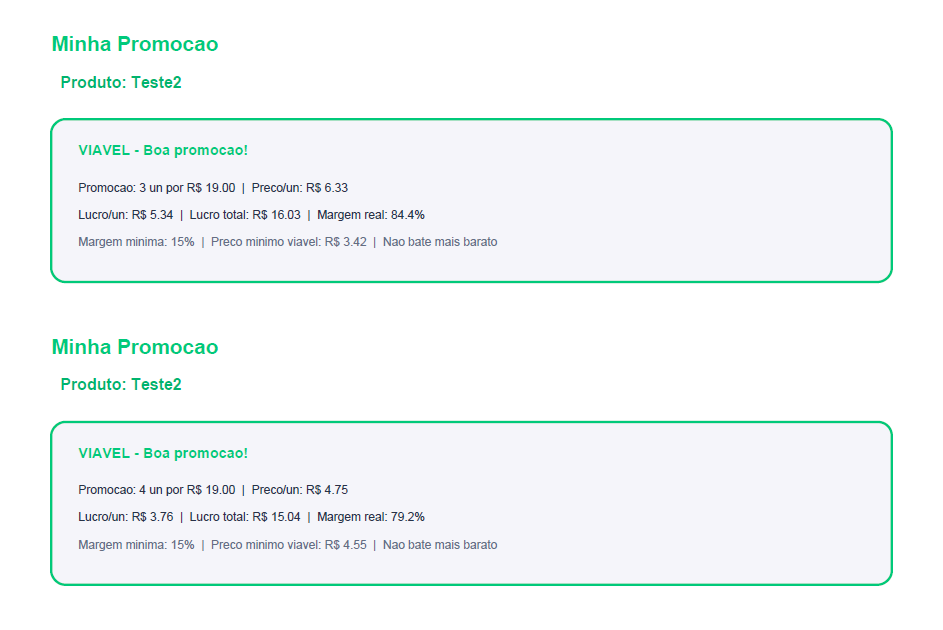

# DealMetrics — Inteligência de Preços para Farmácias e Drogarias

> Ferramenta web para precificação estratégica de medicamentos com comparação de concorrentes, simulação de promoções e exportação de relatórios.

🔗 **[Acessar agora → deal-metrics.netlify.app](https://deal-metrics.netlify.app)**

---

## Screenshots

**Calculadora — entrada de dados e resultado:**

| Formulário | Resultado | Comparativo |
|---|---|---|
|  |  |  |

**Minhas Promoções:**


**Lista de produtos cadastrados:**


**Importação:**


**Relatório PDF exportado:**

| Tabela de produtos e promoções| Minhas promoções por produto |
|---|---|
|  |  |

---

## Como Usar

**1. Calcular um medicamento**

- Informe o nome, custo de aquisição, preço de venda (opcional) e margem mínima desejada (padrão: 15%)
- Adicione ao menos um concorrente com nome e preço
- Clique em **Calcular Estratégia**

**2. Importar em lote**

- Acesse a aba **Importar**
- Baixe a planilha modelo ou monte seu próprio CSV ou Excel
- Selecione o arquivo — o app processa e cadastra todos os produtos automaticamente

**3. Exportar relatório**

- Acesse a aba **Produtos**
- Clique em **Exportar relatório em PDF**
- O relatório inclui resumo geral, tabela de produtos e promoções sugeridas por produto

---

## Visão Geral

O DealMetrics é uma aplicação single-page (HTML/CSS/JS puro, sem dependências de backend) desenvolvida para auxiliar farmacêuticos, gestores e analistas comerciais de farmácias e drogarias na precificação de medicamentos de forma estratégica. A partir do custo de aquisição e dos preços praticados pela concorrência, o app calcula automaticamente o preço de venda ideal, simula opções de promoção por quantidade e avalia a viabilidade de cada cenário.

Toda a aplicação roda inteiramente no navegador — não há servidor, não há banco de dados remoto, não há login. Os dados ficam no `localStorage` do dispositivo e são limpos automaticamente após 30 dias.

---

## Funcionalidades

### Calculadora de Precificação

O núcleo do app. A partir do custo de compra e dos preços da concorrência, o sistema executa a seguinte lógica:

- **Preço mínimo viável** — calculado como `custo × (1 + margem_mínima / 100)`, garantindo que nenhuma venda ocorra abaixo do piso de rentabilidade definido pela usuária.
- **Preço sugerido** — posicionado 5% abaixo do concorrente mais barato, sempre respeitando o preço mínimo viável.
- **Análise do preço informado** — se o usuário já tem um preço de venda em mente, o app avalia se ele é viável (✅), merece atenção (⚠️) ou está inviável (❌) com base na margem mínima configurada.
- **Comparativo visual** — cards lado a lado exibindo meu custo, meu preço e cada concorrente, com destaque cromático para o mais barato do mercado.
- **Múltiplos concorrentes** — é possível adicionar quantos concorrentes forem necessários; o sistema calcula menor preço, maior preço e média automaticamente.

### Simulador de Promoções

Após o cálculo principal, o app gera automaticamente sugestões de promoções por quantidade (2, 3, 4 unidades), cada uma com:

- Preço total e preço por unidade
- Margem real da promoção
- Indicação se a promoção "bate" (é mais barata que) o concorrente
- Status de viabilidade (Viável / Atenção / Inviável)

As promoções geradas podem ser salvas num histórico dentro da sessão para comparação posterior.

### Lista de Produtos

Painel com todos os medicamentos já calculados, ordenados pelo mais recente. Para cada produto é exibido:

- Nome, data do último cálculo e nome do concorrente de referência
- Custo de aquisição e preço do concorrente
- Indicador colorido de status (verde = saudável, amarelo = atenção, vermelho = risco)

O painel conta ainda com um botão de exportação de relatório PDF e limpeza total da base local.

### Importação em Lote

Permite importar uma lista de medicamentos via arquivo `.csv` ou `.xlsx` sem necessidade de formatação rígida — o app usa regras pré-definidas para reconhecer automaticamente as colunas de nome, custo, preço do concorrente e nome do concorrente, independente do cabeçalho exato usado.

Também está disponível o download de uma planilha modelo `.xlsx` pré-formatada para facilitar o preenchimento.

---

## Lógica de Precificação

```
preço_mínimo    = custo × (1 + margem_mínima / 100)
preço_sugerido  = max(preço_mínimo, menor_concorrente × 0.95)
lucro_unitário  = preço_sugerido - custo
margem_real     = (lucro_unitário / preço_sugerido) × 100

Status do preço informado:
  ✅ VIÁVEL    → preço ≥ preço_mínimo E margem_real ≥ margem_mínima
  ⚠️ ATENÇÃO  → preço ≥ preço_mínimo MAS margem_real < margem_mínima
  ❌ INVIÁVEL  → preço < preço_mínimo
```

---

## Exportação PDF

O relatório PDF é gerado client-side via [jsPDF](https://github.com/parallax/jsPDF) e inclui:

- Cabeçalho com nome do responsável e data de geração
- Resumo geral: total de produtos, custo médio, concorrente médio e ticket médio
- Tabela completa com produto, custo, concorrente, venda sugerida, lucro e margem real
- Seção de promoções sugeridas por produto com status de viabilidade
- Rodapé com numeração de páginas e nome da desenvolvedora

---

## Estrutura do Arquivo

O app é um único arquivo `.html` autocontido. Internamente, está organizado em três seções:

```
deal-metrics-final.html
│
├── <style>          — Design system completo com CSS variables, componentes e animações
├── <body>           — Estrutura HTML com os três painéis (Calcular / Produtos / Importar)
└── <script>         — Toda a lógica de negócio, persistência e geração de PDF/XLSX
```

### Módulos JavaScript internos

| Módulo | Responsabilidade |
|---|---|
| `calcular()` | Orquestra o cálculo principal e renderiza os resultados |
| `gerarPromos()` | Gera as simulações de promoção por quantidade |
| `renderLista()` | Renderiza o painel de produtos cadastrados |
| `gerarPDF()` | Exporta relatório completo via jsPDF |
| `importarCSV()` | Faz parsing e normalização do arquivo importado |
| `baixarModelo()` | Decodifica e disponibiliza para download o modelo `.xlsx` embutido em base64 |
| `recycle()` | Remove do `localStorage` registros com mais de 30 dias |
| `renderHistoricoPromos()` | Gerencia o histórico de simulações de promoção da sessão |

---

## Persistência de Dados

Os dados são armazenados exclusivamente no `localStorage` do navegador, sob a chave `dealMetricsProdutos`. Cada produto é salvo com um `timestamp` de criação; registros com mais de **30 dias** são removidos automaticamente na inicialização do app (função `recycle`).

Não há sincronização entre dispositivos. Para transferir dados, use a exportação PDF ou reimporte via CSV.

---

## Design System

A interface utiliza um tema escuro consistente com as seguintes fontes e variáveis:

**Fontes**
- Display: `Syne` (títulos e labels)
- Body: `DM Sans` (texto geral)
- Mono: `DM Mono` (valores numéricos)

**Paleta**

| Variável | Valor | Uso |
|---|---|---|
| `--verde` | `#00C97B` | Ações primárias, status viável |
| `--vermelho` | `#FF4B4B` | Alertas, status inviável |
| `--amarelo` | `#FFD23F` | Atenção, promoções |
| `--roxo` | `#A78BFA` | Exportação PDF |
| `--bg` | `#0D0F14` | Fundo base |
| `--surface` | `#161921` | Cards e componentes |

---

## Deploy

O projeto é um arquivo estático único — sem build step, sem dependências para instalar.

**Para atualizar o deploy:**

1. Renomeie `deal-metrics-final.html` para `index.html`
2. Suba o arquivo para o repositório no GitHub
3. O Netlify detecta automaticamente e publica a nova versão

**Estrutura esperada no repositório:**

```
.
├── index.html          # aplicação completa
└── screenshots/        # imagens usadas no README
```

**Rodando localmente:**

Basta abrir o `index.html` no navegador. Sem servidor necessário.

```bash
# Opcional: qualquer servidor estático também funciona
npx serve .
```

---

## Dependências Externas

| Biblioteca | Versão | Uso | Fonte |
|---|---|---|---|
| jsPDF | 2.5.1 | Geração de PDF client-side | cdnjs.cloudflare.com |

Apenas uma dependência externa, carregada via CDN. O app funciona offline após o primeiro carregamento desde que o cache do navegador esteja ativo.

---

## Compatibilidade

Funciona em qualquer navegador moderno com suporte a ES6+, `localStorage` e `Blob API`. Otimizado para telas mobile (max-width 480px) com layout responsivo.

---

## Responsável

Desenvolvido por **Mayara Almeida**
